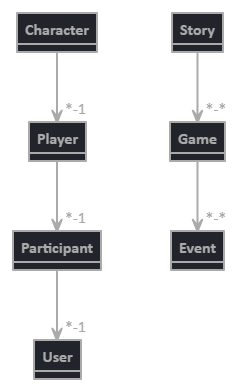
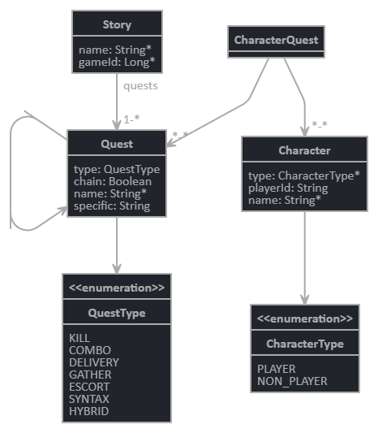
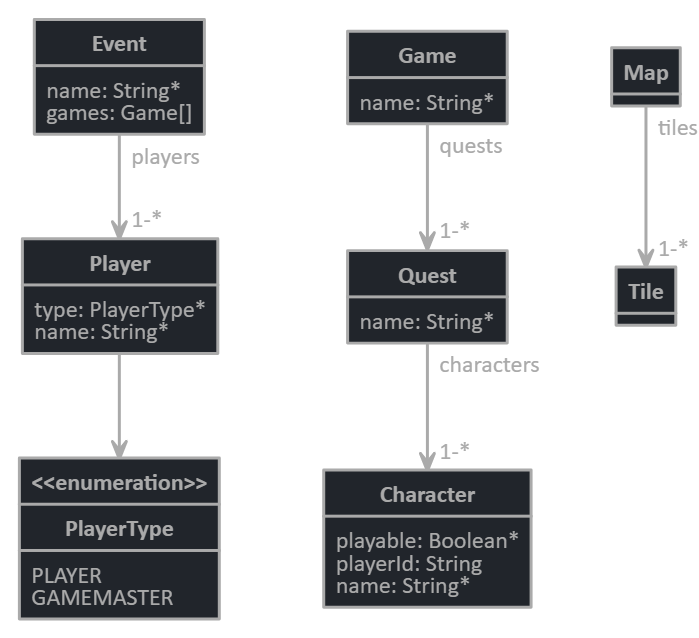
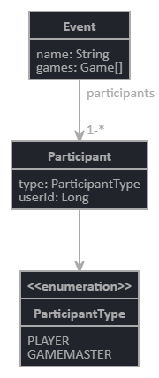
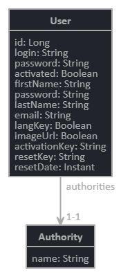
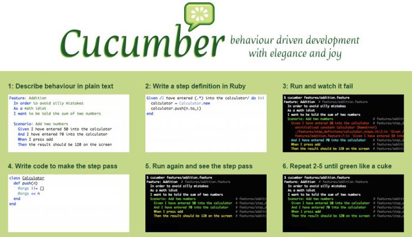

project-larp
===

## Content

* [Process](#process)
* [Specs](#specs)
* [Models](#models)
* [HowTo](#howto)
---

## Process

TODO

---

## Specs

TODO

---

## Models

General

All

---

## HowTo

Features - 
https://damienfremont.com/2015/01/29/tests-bdd-avec-cucumber-java/

Model - 
https://start.jhipster.tech/jdl-studio/